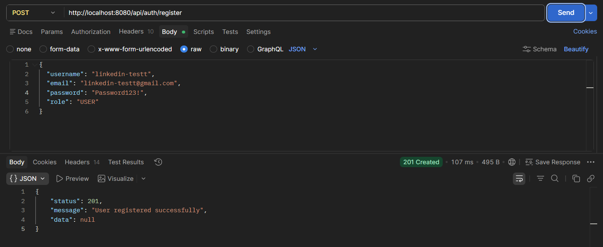
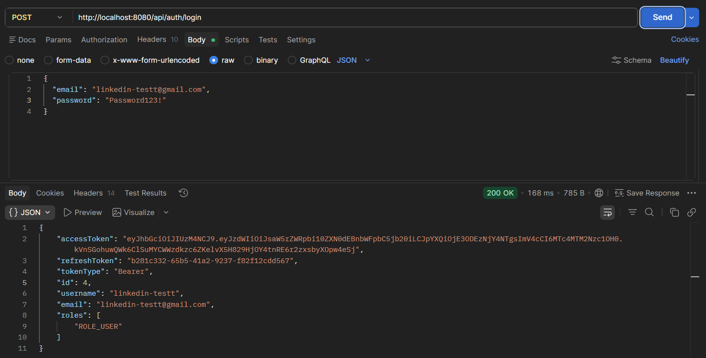
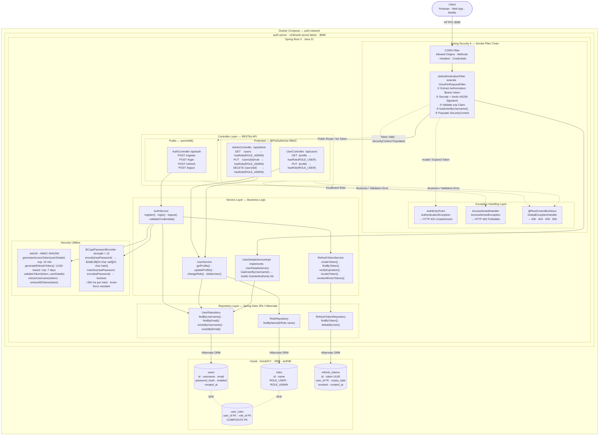
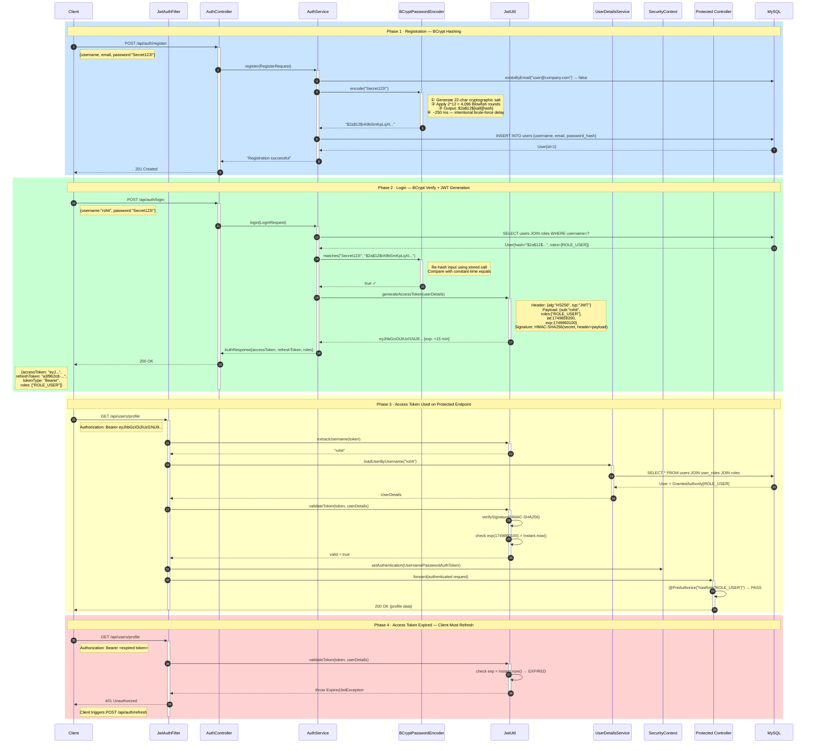
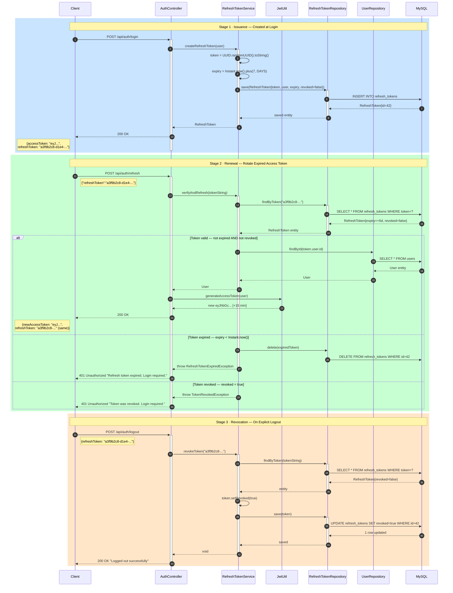
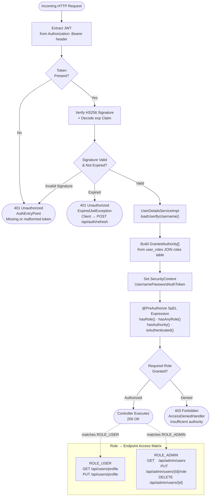
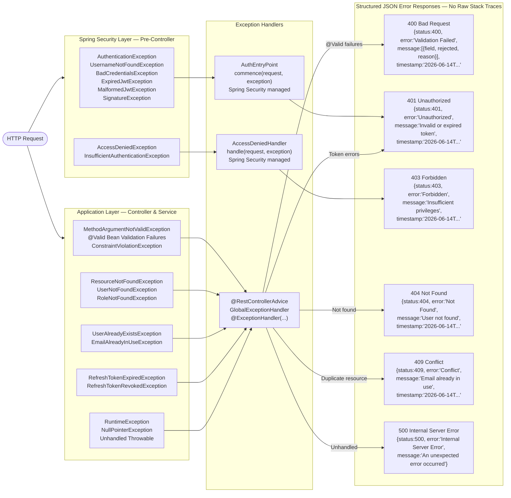

# Enterprise JWT Auth Server

A robust, production-ready authentication and authorization server built with **Spring Boot 3** and **Spring Security 6**. Designed with a focus on security, stateless scalability, and containerized deployment.

## 🚀 Features

*   **Stateless Authentication**: Implements JWT (JSON Web Tokens) with a 15-minute access token lifespan and a 7-day refresh token strategy with database-backed revocation.
*   **Production-Grade Security**: 
    *   Passwords protected with **BCrypt** hashing.
    *   Role-Based Access Control (RBAC) using `@PreAuthorize`.
    *   Credential enumeration protection (generic login error messages).
    *   No sensitive data exposed via global exception handling.
*   **Enterprise Architecture**:
    *   **Custom Handlers**: Dedicated `JwtAuthenticationEntryPoint` and `JwtAccessDeniedHandler` for clean JSON error responses (401/403).
    *   **Environment-Aware**: Configured via environment variables for 12-factor app compliance.
    *   **Safety Guards**: `@Profile("!prod")` prevents accidental seeding of test accounts in production environments.
*   **Infrastructure**:
    *   **Dockerized**: Multi-stage `Dockerfile` (Maven builder + Alpine JRE runtime) for minimal image size (~100MB).
    *   **Orchestration**: `docker-compose.yml` with automated MySQL health checks to ensure dependency readiness.

## 🛠 Tech Stack

*   **Language**: Java 21
*   **Framework**: Spring Boot 3 / Spring Security 6
*   **Database**: MySQL
*   **Containerization**: Docker & Docker Compose
*   **Build Tool**: Maven

## 📋 Prerequisites

*   [Docker Desktop](https://www.docker.com/products/docker-desktop/) installed and running.
*   Java 21 installed (if running locally without Docker).

## 🚀 Quick Start (Docker)

1. **Clone the repository:**
```bash
   git clone https://github.com/rohit-santraa/enterprise-jwt-auth-server.git
   cd auth-server
```
2. **Build and start the infrastructure:**

```bash
   docker compose up --build
```
3. **Access the application:**
The application will be available at http://localhost:8080.


## 📸 API Demonstration

### 1. User Registration (`POST /api/auth/register`)
Successfully registering a new enterprise user account with role-based permissions.



### 2. User Login & JWT Generation (`POST /api/auth/login`)
Exchanging valid credentials for secure, stateless Access and Refresh tokens.




## System Architecture



---

## Access Token Flow (includes BCrypt)



---

## Refresh Token Lifecycle



---

## RBAC Authorization Decision Flow



---

## Exception Handling Matrix



---

## API Reference

| Method | Endpoint | Auth | Role | Description |
|--------|----------|------|------|-------------|
| POST | `/api/auth/register` | None | — | Create account, BCrypt hash password |
| POST | `/api/auth/login` | None | — | Authenticate, receive token pair |
| POST | `/api/auth/refresh` | None | — | Exchange refresh token for new access token |
| POST | `/api/auth/logout` | Bearer | Any | Revoke refresh token |
| GET | `/api/users/profile` | Bearer | ROLE_USER | Read own profile |
| PUT | `/api/users/profile` | Bearer | ROLE_USER | Update own profile |
| GET | `/api/admin/users` | Bearer | ROLE_ADMIN | List all users |
| PUT | `/api/admin/users/{id}/role` | Bearer | ROLE_ADMIN | Change user role |
| DELETE | `/api/admin/users/{id}` | Bearer | ROLE_ADMIN | Delete user |

## Token Specifications

| Token | Algorithm | Expiry | Storage | Transport |
|-------|-----------|--------|---------|-----------|
| Access Token | JWT · HS256 | 15 minutes | Client memory | Authorization: Bearer header |
| Refresh Token | UUID string | 7 days | MySQL `refresh_tokens` table | Request body |

## Error Response Schema

```json
{
  "status": 401,
  "error": "Unauthorized",
  "message": "JWT token has expired",
  "timestamp": "2026-06-14T10:30:00Z",
  "path": "/api/users/profile"
}
```
