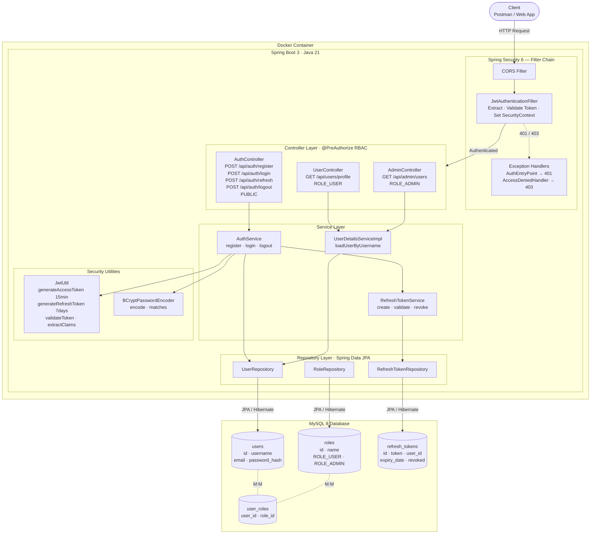
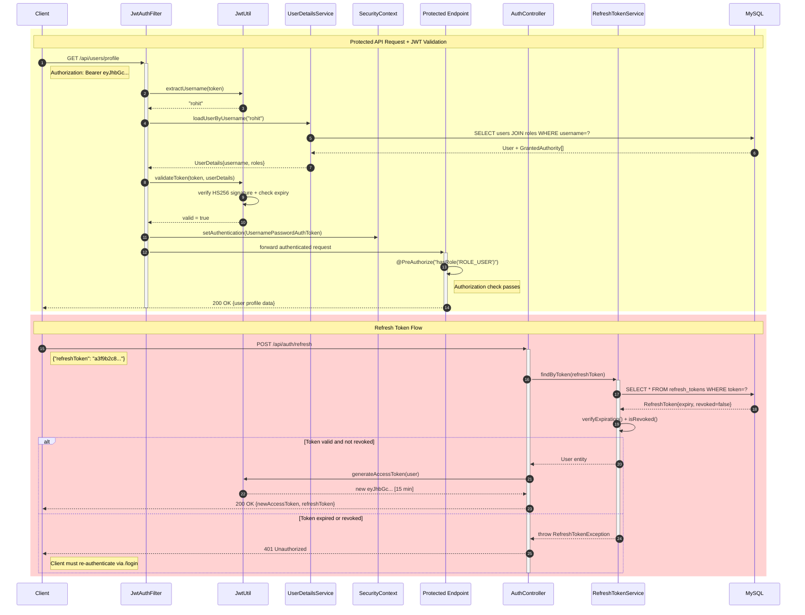

# Enterprise JWT Auth Server

A robust, production-ready authentication and authorization server built with **Spring Boot 3** and **Spring Security 6**. Designed with a focus on security, stateless scalability, and containerized deployment.

## 🚀 Features

*   **Stateless Authentication**: Implements JWT (JSON Web Tokens) with a 15-minute access token lifespan and a 7-day refresh token strategy with database-backed revocation.
*   **Production-Grade Security**: 
    *   Passwords protected with **BCrypt** hashing.
    *   Role-Based Access Control (RBAC) using `@PreAuthorize`.
    *   Credential enumeration protection (generic login error messages).
    *   No sensitive data exposed via global exception handling.
*   **Enterprise Architecture**:
    *   **Custom Handlers**: Dedicated `JwtAuthenticationEntryPoint` and `JwtAccessDeniedHandler` for clean JSON error responses (401/403).
    *   **Environment-Aware**: Configured via environment variables for 12-factor app compliance.
    *   **Safety Guards**: `@Profile("!prod")` prevents accidental seeding of test accounts in production environments.
*   **Infrastructure**:
    *   **Dockerized**: Multi-stage `Dockerfile` (Maven builder + Alpine JRE runtime) for minimal image size (~100MB).
    *   **Orchestration**: `docker-compose.yml` with automated MySQL health checks to ensure dependency readiness.

## 🛠 Tech Stack

*   **Language**: Java 21
*   **Framework**: Spring Boot 3 / Spring Security 6
*   **Database**: MySQL
*   **Containerization**: Docker & Docker Compose
*   **Build Tool**: Maven

## 📋 Prerequisites

*   [Docker Desktop](https://www.docker.com/products/docker-desktop/) installed and running.
*   Java 21 installed (if running locally without Docker).

## 🚀 Quick Start (Docker)

1. **Clone the repository:**
```bash
   git clone https://github.com/rohit-santraa/enterprise-jwt-auth-server.git
   cd auth-server
```
2. **Build and start the infrastructure:**

```bash
   docker compose up --build
```
3. **Access the application:**
The application will be available at http://localhost:8080.


## 📸 API Demonstration

### 1. User Registration (`POST /api/auth/register`)
Successfully registering a new enterprise user account with role-based permissions.


### 2. User Login & JWT Generation (`POST /api/auth/login`)
Exchanging valid credentials for secure, stateless Access and Refresh tokens.


## Architecture



## Registration & Login Flow

```mermaid
sequenceDiagram
    autonumber
    participant C as Client
    participant AC as AuthController
    participant AS as AuthService
    participant BCR as BCryptPasswordEncoder
    participant JU as JwtUtil
    participant UR as UserRepository
    participant RR as RoleRepository
    participant RTS as RefreshTokenService
    participant DB as MySQL

    rect rgb(200, 230, 255)
        Note over C,DB: User Registration Flow
        C->>+AC: POST /api/auth/register
        Note right of C: {username, email, password}
        AC->>+AS: register(RegisterRequest)
        AS->>UR: existsByEmail(email)
        UR->>DB: SELECT COUNT(*) FROM users WHERE email=?
        DB-->>UR: 0
        UR-->>AS: false
        AS->>BCR: encode(rawPassword)
        BCR-->>AS: $2a$10$hashedPassword
        AS->>RR: findByName("ROLE_USER")
        RR->>DB: SELECT * FROM roles WHERE name=?
        DB-->>RR: Role{ROLE_USER}
        RR-->>AS: Role entity
        AS->>UR: save(newUser)
        UR->>DB: INSERT INTO users + user_roles
        DB-->>UR: User{id=1}
        UR-->>-AS: saved User
        AS-->>-AC: success message
        AC-->>C: 201 Created
    end

    rect rgb(200, 255, 200)
        Note over C,DB: Login & Token Generation Flow
        C->>+AC: POST /api/auth/login
        Note right of C: {username, password}
        AC->>+AS: login(LoginRequest)
        AS->>UR: findByUsername(username)
        UR->>DB: SELECT users JOIN user_roles JOIN roles WHERE username=?
        DB-->>UR: User + Roles[]
        UR-->>AS: User entity
        AS->>BCR: matches(rawPassword, storedHash)
        BCR-->>AS: true
        AS->>JU: generateAccessToken(userDetails)
        Note right of JU: Sign HS256, embed username + roles,<br/>set expiry 15 minutes
        JU-->>AS: eyJhbGciOiJIUzI1... [Access JWT]
        AS->>+RTS: createRefreshToken(user)
        RTS->>DB: INSERT INTO refresh_tokens
        DB-->>RTS: RefreshToken entity
        RTS-->>-AS: uuid-token [7 days]
        AS-->>-AC: AuthResponse
        AC-->>C: 200 OK
        Note left of C: {accessToken, refreshToken,<br/>tokenType: Bearer, roles[]}
    end
```

## Protected Request & Refresh Token Flow


